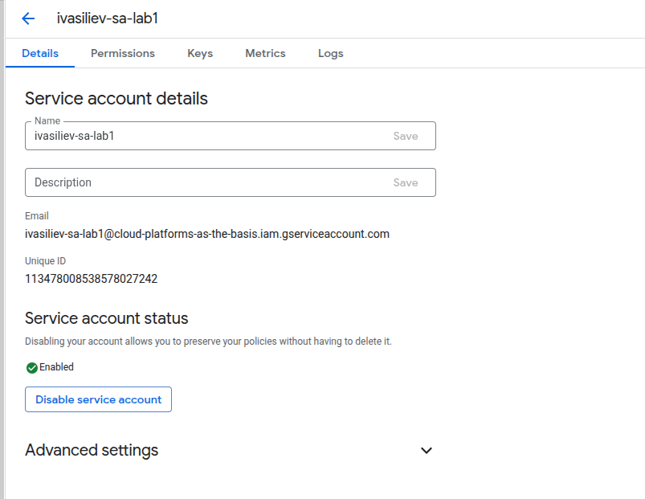
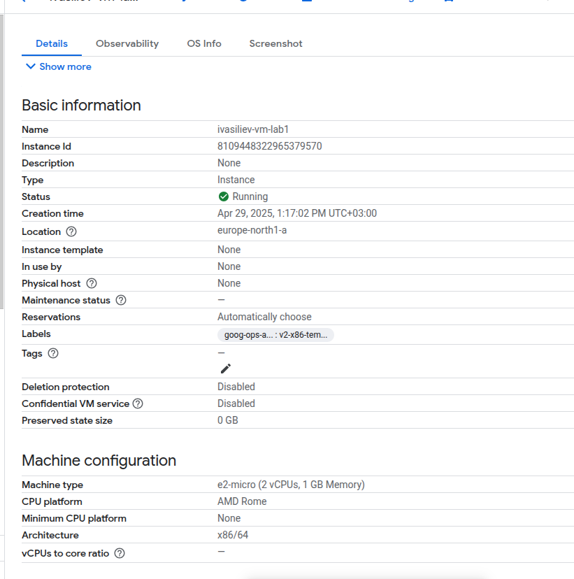
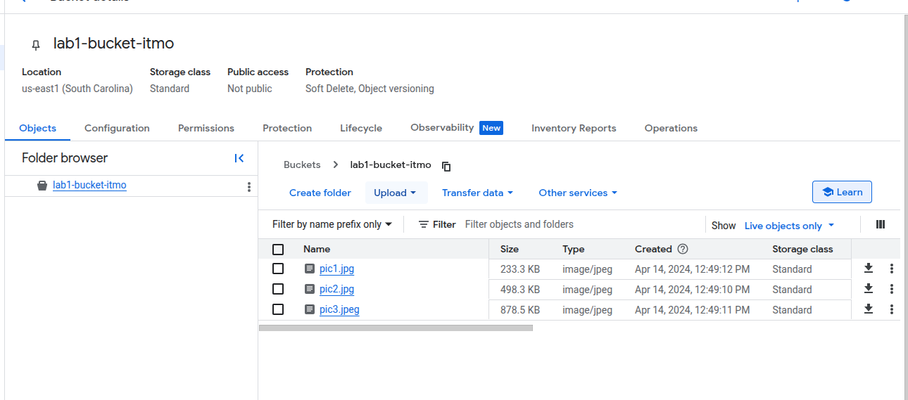
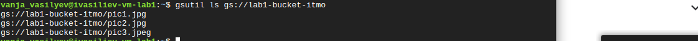
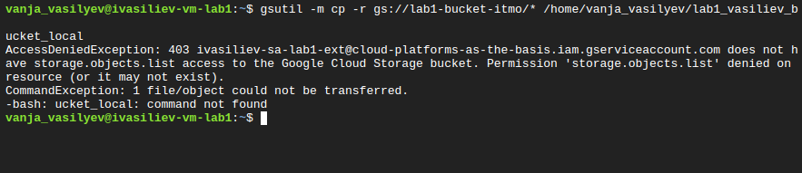

University: [ITMO University](https://itmo.ru/ru/)
Faculty: [FICT](https://fict.itmo.ru)
Course: [Cloud platforms as the basis of technology entrepreneurship](https://itmo-ict-faculty.github.io/cloud-platforms-as-the-basis-of-technology-entrepreneurship)
Year: 2024/2025
Group: U4125
Author: Vasiliev Ivan Alexeivich
Lab: Lab1
Date of create: 29.04.2025
Date of finished: 29.04.2025

1. Была заполнена форма для доступа к Goodle Cloud
2. Во вкладке IAM cнизу слева в Service Account был создан Service Account с ролью Storage Admin
нейминг ivasiliev-sa-lab1 

3. Была создана vm с именем ivasiliev-vm-lab1 в режиме spot и Machine type e2-micro, ОС Ubuntu 22.04 LTS, location Финляндия

4. В Cloud Storage был найден бакет lab1-bucket-itmo

5. Был выполнен вход в vm через ssh. Через команду ``gsutil ls gs://lab1-bucket-itmo`` мы видим содержимое бакета

6. Скопированы файлы из бакета с помощью команды 
``gsutil -m cp -r gs://lab1-bucket-itmo/* /home/vanja_vasilyev/lab1_vasiliev_b
ucket_local``
7. После смены роли на Compute Viewer, нет возможности копировать, поскольку права readonly.

