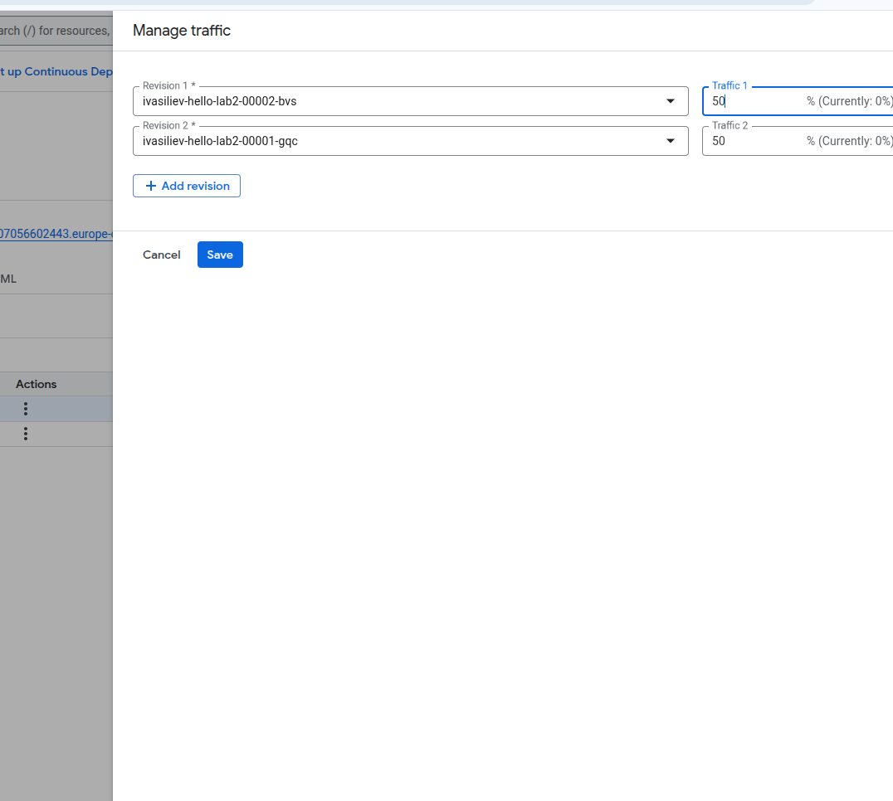

University: [ITMO University](https://itmo.ru/ru/)
Faculty: [FICT](https://fict.itmo.ru)
Course: [Cloud platforms as the basis of technology entrepreneurship](https://itmo-ict-faculty.github.io/cloud-platforms-as-the-basis-of-technology-entrepreneurship)
Year: 2024/2025
Group: U4125
Author: Vasiliev Ivan Alexeivich
Lab: Lab2
Date of create: 29.04.2025
Date of finished: 29.04.2025

1. Был создан cloud run из дефелотного сервиса Hello, назначены права

2. Логи отражают процесс создания сервиса, использованные сети, порты

3. Метрики отражают текущее состояние контейнера по загрузке памяти, cpu, rps

4. Меняем порт

5. Теперь у нас 2 ревизии

6. Разделили трафик на 2 ревизии

Теперь он балансируется

