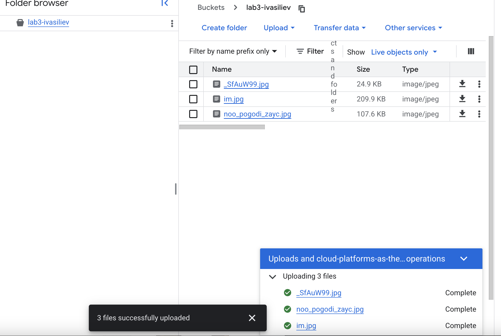
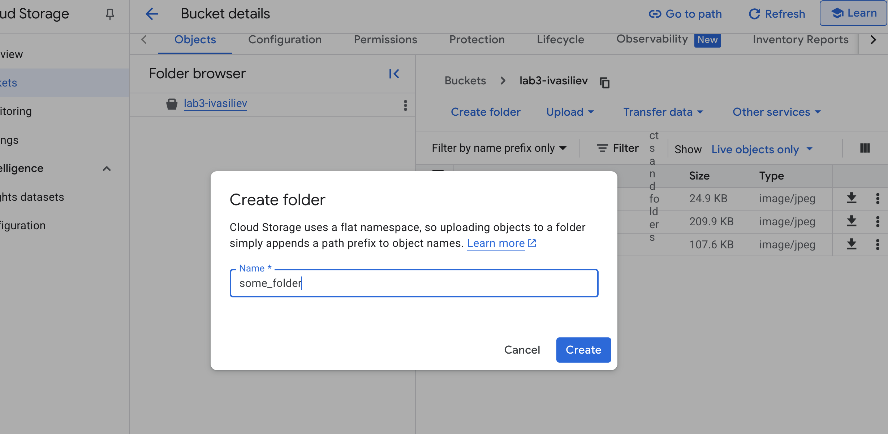
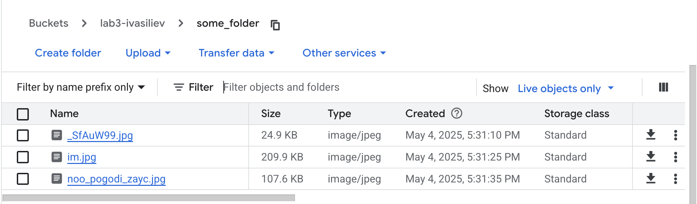
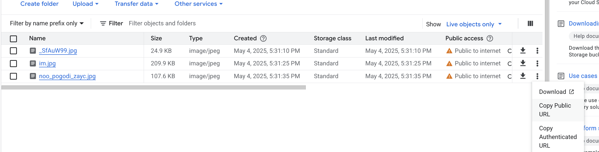

University: [ITMO University](https://itmo.ru/ru/)
Faculty: [FICT](https://fict.itmo.ru)
Course: [Cloud platforms as the basis of technology entrepreneurship](https://itmo-ict-faculty.github.io/cloud-platforms-as-the-basis-of-technology-entrepreneurship)
Year: 2024/2025
Group: U4125
Author: Vasiliev Ivan Alexeivich
Lab: Lab3
Date of create: 04.05.2025
Date of finished: 04.05.2025

1. Был создан bucket с правами force public

2. Загружены 3 фото в bucket

3. Создана папка some_folder

4. Фотографии были перемещены в папку some_folder

5. Был сделан public доступ для всех пользователей

6. Сделана public URI ссылка на фото
https://storage.googleapis.com/lab3-ivasiliev/some_folder/noo_pogodi_zayc.jpg

