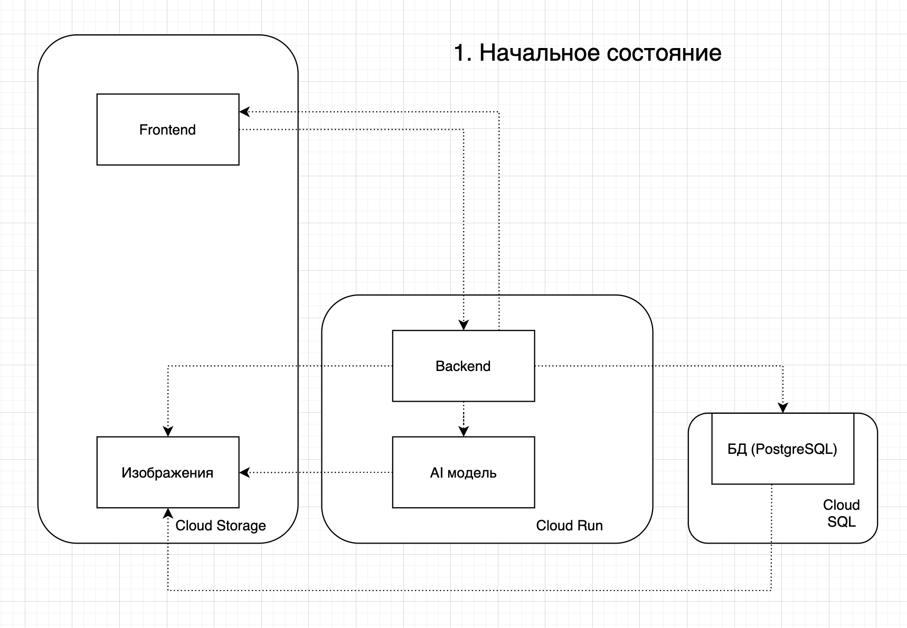
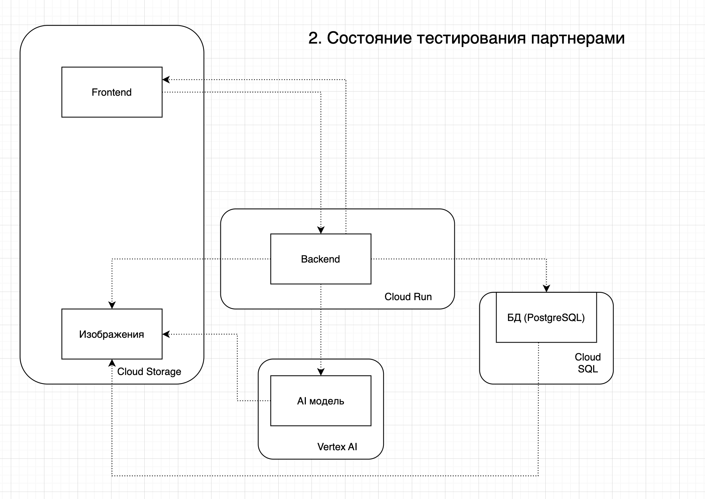
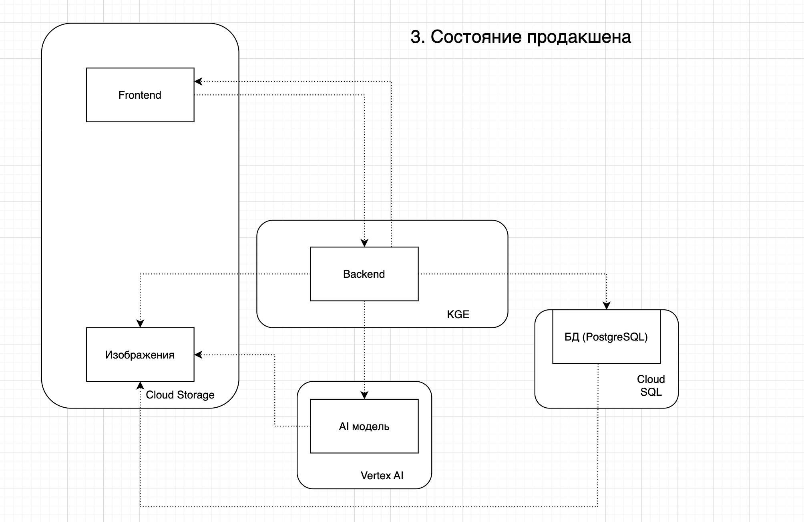

University: [ITMO University](https://itmo.ru/ru/)
Faculty: [FICT](https://fict.itmo.ru)
Course: [Cloud platforms as the basis of technology entrepreneurship](https://itmo-ict-faculty.github.io/cloud-platforms-as-the-basis-of-technology-entrepreneurship)  
Year: 2024/2025
Group: U4125 
Author: Vasiliev Ivan Alexeivich   
Lab: Lab4   
Date of create: 04.05.2025  
Date of finished: 04.05.2025  

В качестве прототипа AI приложения был выбран LetterCheck - Приложение для распознавания и анализа рукописного текста на изображениях (например, анкеты, конспекты).
Работает через веб-интерфейс: пользователь загружает фото → получает распознанный текст и статистику. 

Рассмотрим 3 стадии продукта: Начальное, тестирование партнерами и продовое решение

1. На начальной стадии у нас будет
    1) Backend - Fast API (Cloud run)
    2) Frontend - одностраничник React SPA приложение (в Cloud Storage Static Website Hosting)
    3) AI модель - EfficientNet-B0 (Cloud Run тот же что и Backend)
    4) Хранение изображений для следующих этапов (Cloud Storage)
    5) База данных (Cloud SQL - PostgreSQL) db-g1-small

    Схема начальное стадии:

    Стоимость в месяц при учете, что на начальном этапе у нас 1-5 запросов в минуту и 10 пользователей в день:   
    Cloud run: 2.51 USD  
    Cloud SQL db-g1-small: 21.60 USD PostgreSQL (тут можно было бы взять Compute Engine и самим развернуть, но мы не будем экономить)
    Cloud Storage (20 GB): 0.52 USD
    
    Итого: 24.63 USD

2. На этапе тестирования партнерами будут приняты следующие изменения:
    1) Добавляем в Cloud Run автоскейл группу
    2) AI модель не справлялась, мы ее поместили на Vertex AI Endpoint
    3) Увеличили мощности Cloud Run

    Схема на этапе тестирования партнерами:

    Стоимость в месяц при учете, что у нас 150 пользователей в день

    Cloud run: 6.11 USD   
    Cloud SQL db-g1-small: 21.60 USD  
    Cloud Storage (20 GB): 0.52 USD  
    Vertex AI: 136.80 USD  

    Итого: 165.03 USD (Мы не экономим на основном инструменте)

3. На этапе полноценного выхода в продакшен

    1) Мы поняли на предыдущем этапе, что нам не хватает мощности PostgreSQL, берем db-n1-standard-2   
    2) Подключаем Cloud CI/CD для автоматизированной выкладки в прод   
    3) Заменяем автогруппу на k8s, в Goodle Cloud - GKE Standard  
    4) Увеличиваем Cloud Storage до 200 Гб  
    5) Подключаем логи и метрики через Cloud Monitoring	  

    Схема на этапе продакшена:

    Стоимость в месяц при учете, что у нас 1000 пользователей в день

    KGE: 136.8 USD  
    Vertex AI: 136.80 USD  
    Cloud Storage (200 GB): 5.2 USD  
    Сloud SQL db-g1-standard: 68.40 USD  
    Cloud Monitoring: бесплатно (хватает бесплатного тарифа на день)  
    Сloud CI/CD: бесплатно (укладываемся в лимит)  

    Итого версия для продакшена будет стоить 347.2 USD

